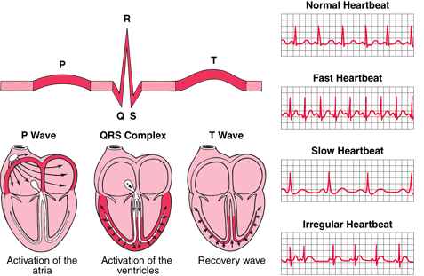

# Arrhythmia-ECG-Classification
 Arrhythmia on ECG Classification using CNN (Convolutional Neural Network)


<p style="text-align: center;">
    <a href="https://www.sevencountriesstudy.com/ecg-predictors-and-coronary-heart-disease/">[image source]</a>
</p>

## Background

### Aritmia
> Aritmia adalah suatu tanda atau gejala dari gangguan detak jantung atau irama jantung.[1] Hal ini bisa dirasakan ketika misalnya, jantung berdetak lebih cepat dari normal yang selanjutnya disebut takikardia atau ketika jantung berdetak lebih lambat dari normal, yang disebut sebagai bradikardia.[1] Jantung yang berdenyut melambat tentu akan mengganggu aliran darah sampai ke otak sehingga penderitanya sewaktu-waktu dapat pingsan.[2] Sebaliknya, jika jantung berdenyut terlalu cepat dalam jangka yang lama maka dapat mengarah pada gagal jantung kongestif yang tentunya sangat berbahaya.[2] Aritmia timbul bilamana penghantaran listrik pada jantung yang mengontrol detak jantung mengalami gangguan, ini dapat terjadi bila sel saraf khusus yang ada pada jantung yang bertugas menghantarkan listrik tersebut tidak bekerja dengan baik.[1] Aritmia juga dapat terjadi bila bagian lain dari jantung menghantarkan sinyal listrik yang abnormal.[1] ([sumber](https://id.wikipedia.org/wiki/Aritmia)).


### Elektrokardiogram (EKG) atau Electrocardiogram (ECG)

>EKG atau ECG (electrocardiogram) merupakan sinyal yang didapat dari aktivitas gelombang listrik yang dihasilkan oleh jantung. Sinyal EKG terdiri dari gelombang P, kompleks QRS, dan gelombang T digunakan untuk mendeteksi kelainan jantung atau aritmia. Urutan terjadinya sinyal EKG yang dapat menimbulkan gelombang P, kompleks QRS, dan gelombang T ([sumber](https://journal.uii.ac.id/jurnal-teknoin/article/download/4651/4098)).
1. Gelombang P, terjadi akibat kontraksi otot atrium , gelombang ini relative kecil karena otot atrium yang relative tipis.
2. Gelombang QRS, trejadi akibat kontraksi otot ventrikel yang tebal sehingga gelombang QRS cukup tinggi. Gelombang Q merupakan depleksi pertama kebawah. Selanjutnya depleksi ke atas adalah gelombang R. Depleksi kebawah setelah gelombang R disebut gelombang S.
3. Gelombang T, terjadi akibat kembalinya otot ventrikel ke keadaan listrik istirahat.


### ECG Dataset
#### Download dataset : 
- Test : https://www.kaggle.com/shayanfazeli/heartbeat/data?select=mitbih_test.csv
- Train : https://www.kaggle.com/shayanfazeli/heartbeat/data?select=mitbih_train.csv

```
Number of Samples: 109446
Number of Categories: 5
Sampling Frequency: 125Hz
Data Source: Physionet's MIT-BIH Arrhythmia Dataset
Classes: ['N': 0, 'S': 1, 'V': 2, 'F': 3, 'Q': 4]
```


- Original Sourcecode : https://www.kaggle.com/gregoiredc/arrhythmia-on-ecg-classification-using-cnn
- Original Source Dataset : https://physionet.org/content/mitdb/1.0.0/
